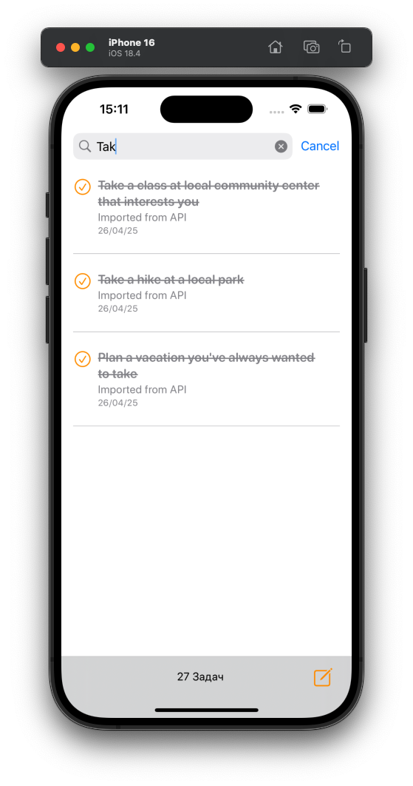
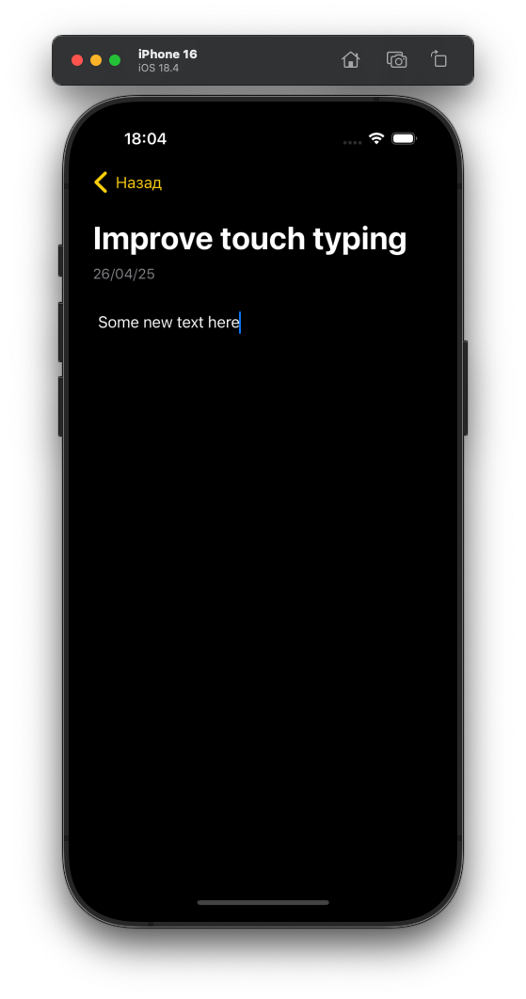

# ToDo List iOS App
A modern, elegant task management application built with SwiftUI, featuring a clean interface and robust functionality.

## Features
### Task Management
- ✓ Create, edit, and delete tasks
- ✓ Mark tasks as complete/incomplete
- ✓ Task descriptions and creation dates
- ✓ Share tasks functionality
- ✓ Long-press gesture for quick actions
### User Interface
- ✓ Clean, intuitive SwiftUI design
- ✓ Dark and light mode support
- ✓ Custom theming system
- ✓ Smooth animations and transitions
- ✓ Responsive layout
### Core Features
- ✓ Local data persistence
- ✓ Search functionality
- ✓ Task counter
- ✓ Task sharing capabilities

## Screenshots

### Light Mode

    

<em>Main task list in light mode</em>

    
    

    

<em>Main task list features in light mode</em>

### Dark Mode

    

<em>Main task list in dark mode</em>

    
    

    

<em>Main task list features in dark mode</em>

## Architecture
### MVVM Pattern
- Models : Core data structures and persistence
- Views : SwiftUI user interface components
- ViewModels : Business logic and data transformation
### Components
- TaskListView : Main task list interface
- TaskView : Individual task component
- TaskRedactorView : Task creation/editing interface
- Custom Theme System : Consistent styling across the app
## Getting Started
### Prerequisites
- Xcode 15.0+
- iOS 16.0+
- Swift 5.0+
### Installation
1. Clone the repository:
2. Open the project in Xcode:
3. Build and run the application
## Usage
### Creating Tasks
1. Tap the pencil icon in the bottom toolbar
2. Enter task title and description
3. Save automatically when navigating back
### Managing Tasks
- Complete/Incomplete : Tap the circle button
- Edit : Tap the task to open editor
- Quick Actions : Long press for additional options
- Share : Use the share button in quick actions
- Delete : Available in quick actions menu
### Search
- Use the search bar to filter tasks
- Searches through titles and descriptions
## Project Structure
The project is structured using the MVVM pattern:
- Screens : Contains main views and their corresponding ViewModels
- Components : Reusable UI components
- Theme : Custom theming system
- Database : CoreData persistence setup

## Folder Structure
Open Folder
ToDo-List/
├── Screens/
│   ├── ToDoListScreen/
│   │   ├── View/
│   │   ├── ViewModel/
│   │   └── Model/
│   ├── Task/
│   │   ├── View/
│   │   ├── ViewModel/
│   │   └── Model/
│   └── TaskRedactorScreen/
│       ├── View/
│       └── ViewModel/
└── Components/
├── Theme/
└── Database/

Fold

## Testing
- Unit tests for ViewModels
- UI tests for core functionality
- Test coverage for data persistence
## Contributing
1. Fork the repository
2. Create your feature branch
3. Commit your changes
4. Push to the branch
5. Create a Pull Request
## License
This project is licensed under the MIT License - see the LICENSE file for details.

## Acknowledgments
- SwiftUI for modern UI framework
- CoreData for persistence
- Apple's SF Symbols for icons
## Contact
Savva Ponomarev

Project Link: https://github.com/Sawolfer/ToDo-List